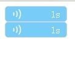

# audio
audio style, 音频播放器样式

demo示例:[http://www.lovewebgames.com/jsmodule/dialog.html](http://www.lovewebgames.com/jsmodule/dialog.html)

    <audio src="horse.ogg" class="audio" controls="controls">
    Your browser does not support the audio element.
    </audio>
    <audio src="horse.ogg" class="audio" controls="controls">
    Your browser does not support the audio element.
    </audio>
    
    
    

#属性和回调(options)

##target:
	要变化样式的audio
##play:
	开始
##stop:
	停止
##playCallback:
 ` function(this.audio,this.audio.paused,this.durationContent) `
	
	播放或暂停时的回调

##stopCallback
  `function(this,this.audio,this.audio.paused,this.durationContent)`

	停止后的回调
##updateCallback
  `function(this,this.audio,this.audio.duration,this.durationContent))`

	更新进度时的回调